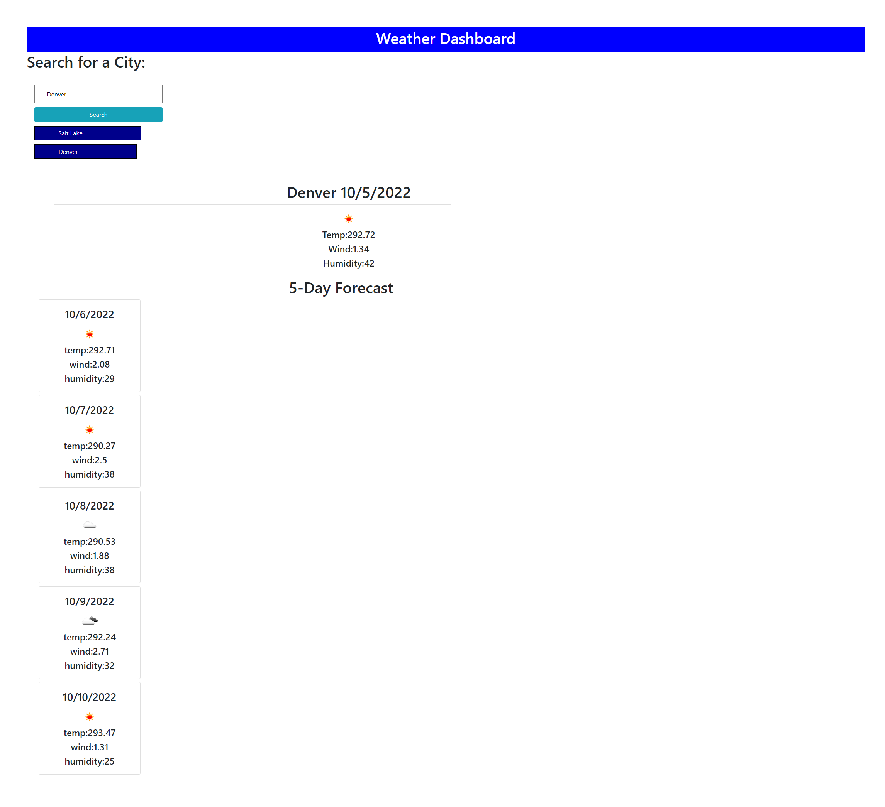

# Weather-Dashboard

## Description

- The motivation behind this project was to build a five day weather forecast for every city in the USA. 
- This project was built because you want to know a city weather before you pay that city a visit. 
- This project alleviate the uncertainty of not knowing what the weather is going to be for a particular city and for the folllowing five days.  
-  During this project I learned how to use Third-party APIs by accessing their data and functionality by making requests with specific parameters to a URL. This is important because developers are often tasked with retrieving data from another application's API and using it in the context of their own. Thus in this project I learned how to build a weather dashboard that will runs in the browser and feature dynamically updated HTML and CSS.


## Credits

[5 Day Weather Forecast](https://openweathermap.org/forecast5)

 `https://api.openweathermap.org/data/2.5/forecast?lat={lat}&lon={lon}&appid={API key}`. 


## User Story

```
AS A traveler
I WANT to see the weather outlook for multiple cities
SO THAT I can plan a trip accordingly
```

## Acceptance Criteria

```
GIVEN a weather dashboard with form inputs
WHEN I search for a city
THEN I am presented with current and future conditions for that city and that city is added to the search history
WHEN I view current weather conditions for that city
THEN I am presented with the city name, the date, an icon representation of weather conditions, the temperature, the humidity, and the wind speed
WHEN I view future weather conditions for that city
THEN I am presented with a 5-day forecast that displays the date, an icon representation of weather conditions, the temperature, the wind speed, and the humidity
WHEN I click on a city in the search history
THEN I am again presented with current and future conditions for that city
```

## Link To Deployed Webpage 

https://eugeneisingizwe.github.io/Weather-Dashboard-/

## Mock-Up

The following image shows the web application's appearance and functionality:




- - -
© 2022 Trilogy Education Services, LLC, a 2U, Inc. brand. Confidential and Proprietary. All Rights Reserved.